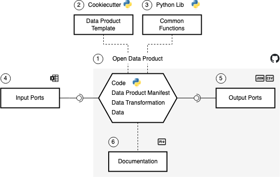

  

  <h1 align="center">Open Data Product</h1>

  

    Providing Open Data as Data Products
  

# Definition of a Data Product

A **Data Product** comprises data, code and infrastructure following these principles

* discoverable
* addressable
* understandable
* trustworthy and truthful
* natively accessible
* interoperable and composable
* valuable on its own
* secure

# Anatomy of an Open Data Product

A Data Product comprises the following aspects

* (1) its core files and directories bundled in a GitHub repository
    * the code (`main.py`) - the main script that contains the logic
    * the data product manifest (`data-product-manfiest.yml`) - the main description of the data product
    * the data transformation (`data-transformation-02-silver.yml` / `data-transformation-03-gold.yml`) - data
      transformation configuration
    * the data directory containing raw (bronze), harmonized (silver) and aggregated (gold) data
* (2) a data product
  template ([open-data-product-cookiecutter](https://github.com/open-data-product/open-data-product-cookiecutter)) that
  provides the project structure
* (3) a Python
  library ([open-data-product-python-lib](https://github.com/open-data-product/open-data-product-python-lib))
  that contains common functions
* (4) input ports - the raw input data of the data product
* (5) output ports - the final output data of the data product
* (6) the documentation
    * data product canvas
    * Open Data Product Specification ([ODPS](https://opendataproducts.org)) canvas
    * Data Product Descriptor Specification ([DPDS](https://dpds.opendatamesh.org)) canvas
    * a Jupyter notebook with examples how to use the data product

